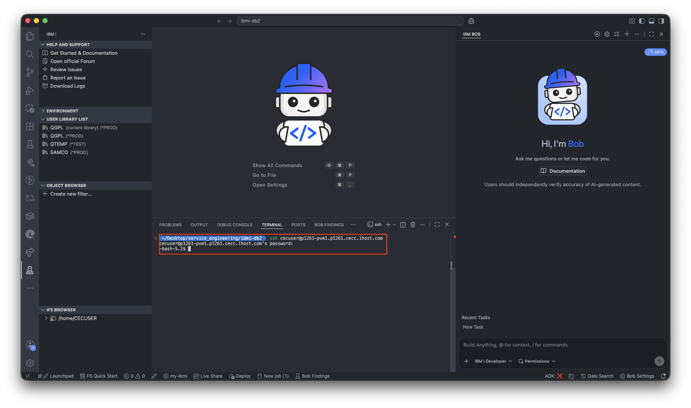
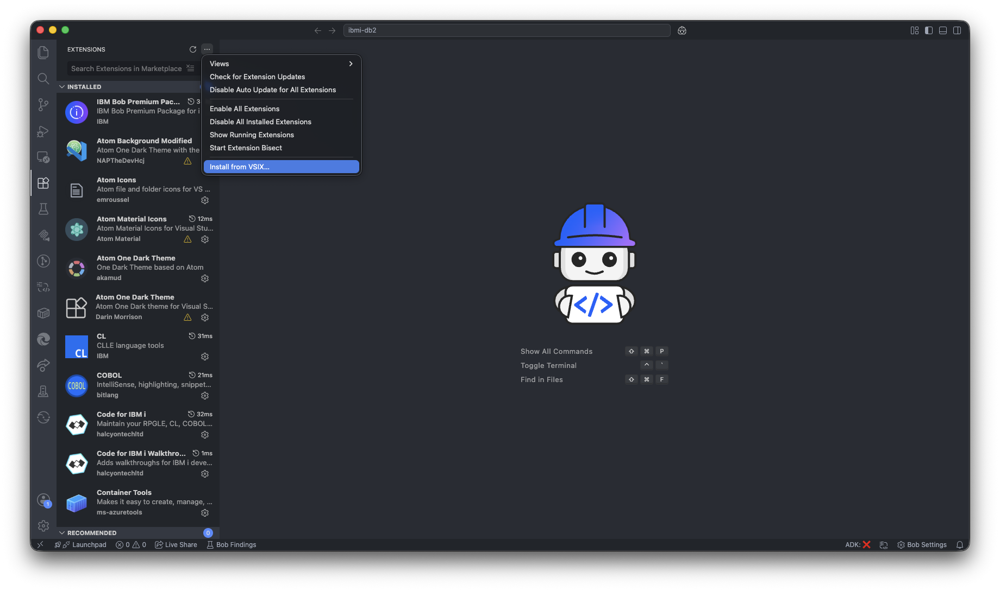
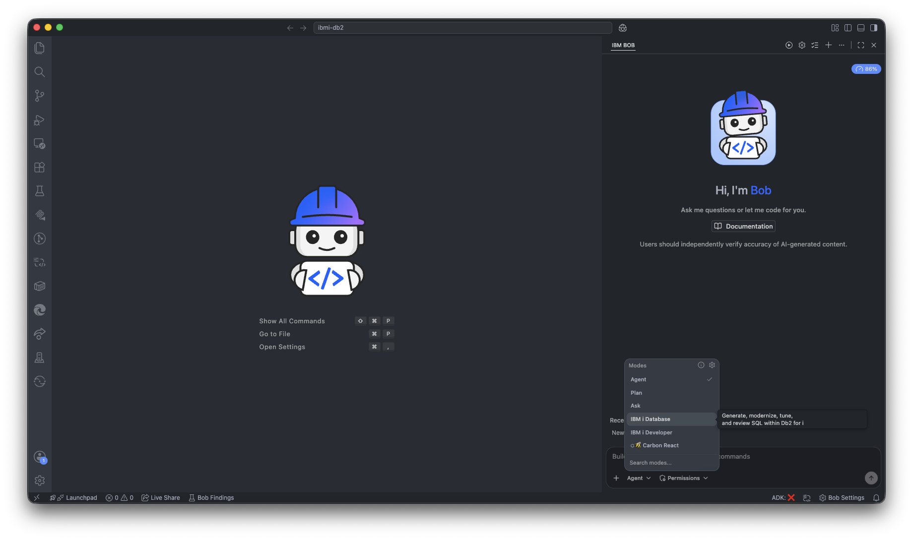
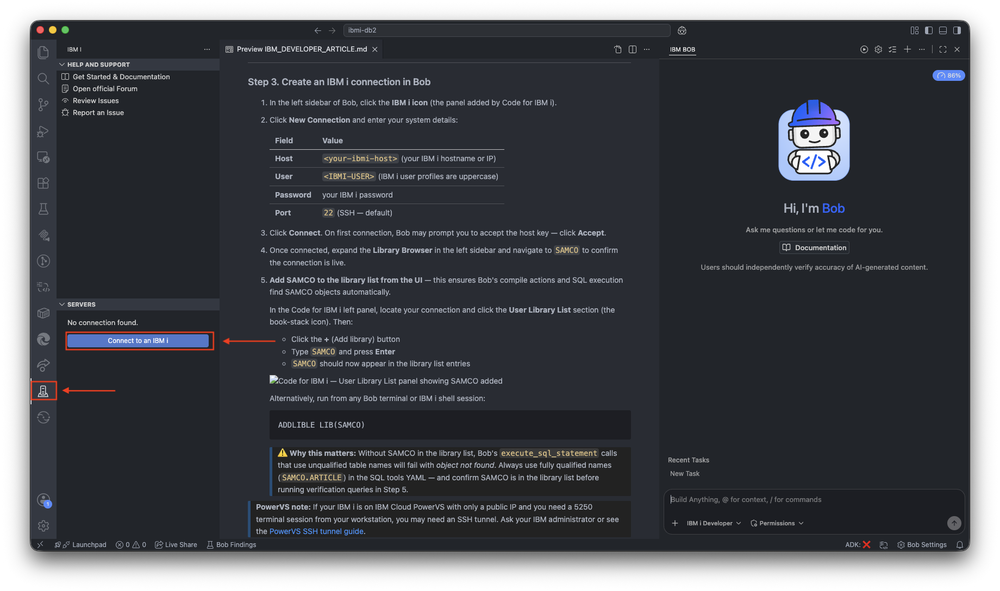
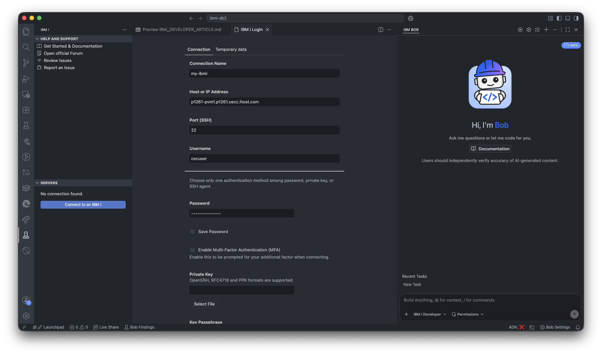
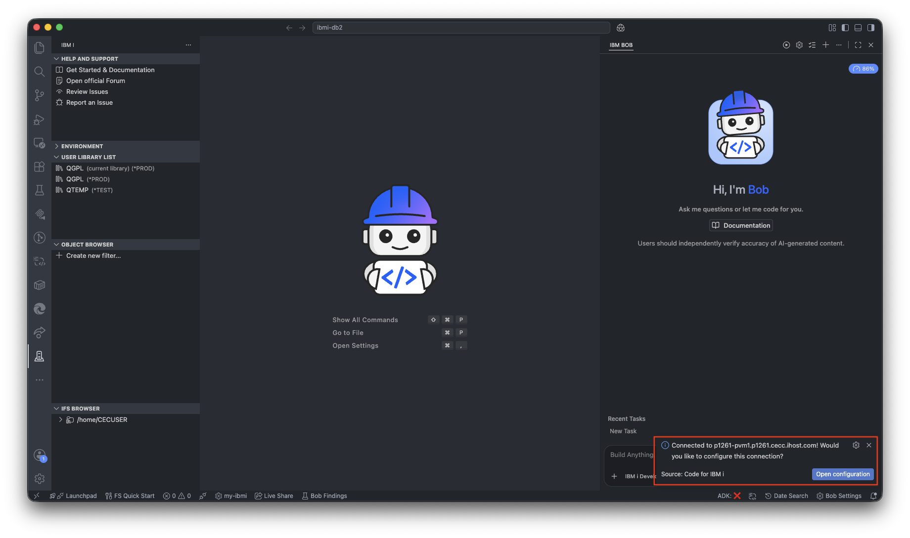
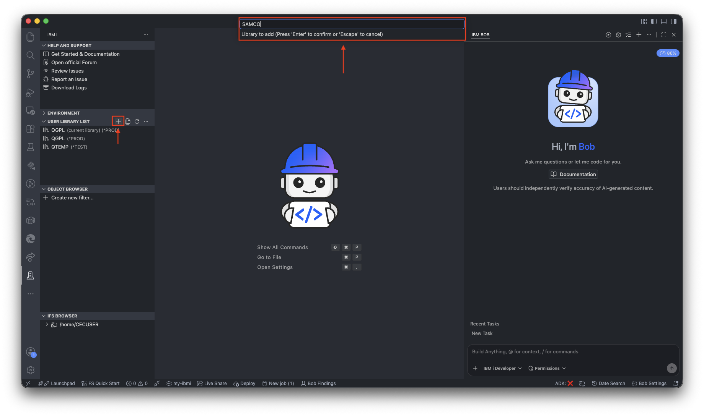

# Connect IBM i (DB2 for i) to watsonx Orchestrate using Bob and the IBM i MCP Server

**A hands-on guide for exposing live DB2 for i data to a watsonx Orchestrate AI agent
using the IBM i MCP Server, Bob, and zero custom application code**

---

**Authors:** Brunda Reddy, Manoj Jahgirdar, Pooja Holkar
**Published:** June 2026  
**Type:** Tutorial  
**Read time:** 20 minutes  
**Skill level:** Intermediate

**Tags:** IBM i · DB2 for i · watsonx Orchestrate · MCP · Model Context Protocol ·
IBM Bob · PowerVS · PASE · AI agent · Mapepire · IBM Cloud

---

## On this page

- [Overview](#overview)
- [Prerequisites](#prerequisites)
- [Architecture](#architecture)
- [Step 0 — Deploy the SAMCO demo schema on IBM i](#step-0--deploy-the-samco-demo-schema-on-ibm-i)
- [Part 1 — Deploy the MCP Server on IBM i](#part-1--deploy-the-mcp-server-on-ibm-i)
  - [Step 1. SSH into IBM i and install the MCP Server package](#step-1-ssh-into-ibm-i-and-install-the-mcp-server-package)
  - [Step 2. Create the MCP Server configuration file](#step-2-create-the-mcp-server-configuration-file)
  - [Step 3. Create the SQL tools definition file](#step-3-create-the-sql-tools-definition-file)
  - [Step 4. Start the MCP Server as a PASE background process](#step-4-start-the-mcp-server-as-a-pase-background-process)
- [Part 2 — Install Bob and connect to IBM i](#part-2--install-bob-and-connect-to-ibm-i)
  - [Step 5. Install Bob and the IBM i Premium Package](#step-5-install-bob-and-the-ibm-i-premium-package)
  - [Step 6. Install the Code for IBM i extension pack](#step-6-install-the-code-for-ibm-i-extension-pack)
  - [Step 7. Create an IBM i connection in Bob](#step-7-create-an-ibm-i-connection-in-bob)
- [Part 3 — Connect Bob to the running MCP Server](#part-3--connect-bob-to-the-running-mcp-server)
  - [Step 8. Configure the IBM i MCP Server in Bob](#step-8-configure-the-ibm-i-mcp-server-in-bob)
  - [Step 9. Verify the end-to-end connection using Bob](#step-9-verify-the-end-to-end-connection-using-bob)
- [Part 4 — Connect IBM i to watsonx Orchestrate](#part-4--connect-ibm-i-to-watsonx-orchestrate)
  - [Step 10. Expose IBM i to watsonx Orchestrate](#step-10-expose-ibm-i-to-watsonx-orchestrate)
  - [Step 11. Register the MCP toolkit in Orchestrate](#step-11-register-the-mcp-toolkit-in-orchestrate)
  - [Step 12. Create the Orchestrate agent](#step-12-create-the-orchestrate-agent)
  - [Step 13. Verify the end-to-end integration](#step-13-verify-the-end-to-end-integration)
- [Query design patterns](#query-design-patterns)
- [Summary](#summary)
- [Next steps](#next-steps)

---

## Overview

Thousands of enterprises run business-critical applications on IBM i. Their data — orders,
customers, inventory, payments — lives in DB2 for i tables that have been refined over decades.
But when organizations want to expose that data to modern AI agents, the answer has usually been
"build a REST API first", "migrate to a cloud database", or "add a middleware layer." That
approach is expensive, time-consuming, and often politically difficult.

The **IBM i MCP Server** ([github.com/IBM/ibmi-mcp-server](https://github.com/IBM/ibmi-mcp-server))
changes this. It runs directly on IBM i as a PASE background process, connects to DB2 via
Mapepire, and exposes any SQL query as a Model Context Protocol (MCP) tool — the same open
standard used by Claude, Cursor, and now watsonx Orchestrate.

In this tutorial, **Bob** (IBM's AI developer assistant) acts as a co-pilot throughout. With
the **IBM i Premium Package** installed, Bob SSHes into IBM i, inspects DB2 schemas, generates
correct PASE shell scripts, writes SQL with proper IBM i conventions, and registers everything
in Orchestrate via the ADK CLI — all from a single chat session.

The result is a live AI agent that answers natural-language questions about real IBM i data —
with no RPG code changes, no Java middleware, and no custom Orchestrate skill code.

### What you will build

By the end of this tutorial you will have:

- Bob fully connected to IBM i via the Code for IBM i extension and the IBM i MCP Server plugin
- The IBM i MCP Server running as a PASE process on IBM i, serving 8 live DB2 query tools
- A watsonx Orchestrate native agent (`samco_retail_agent`) connected to those tools
- End-to-end verified: natural-language questions returning live DB2 rows in under 500ms

### What you will learn

- How to install and configure the IBM i Premium Package and Code for IBM i extension in Bob
- How to connect Bob to an IBM i system and browse DB2 schemas interactively
- How the Model Context Protocol (MCP) bridges watsonx Orchestrate and IBM i DB2
- How to define SQL query tools in a YAML file using bind variables and IBM i-specific syntax
- How the Orchestrate toolkit–agent architecture works and why the IBM i connection is stored
  in the toolkit, not the agent
- Three query design patterns: static SQL, dynamic Text-to-SQL, and hybrid production approach

---

## Prerequisites

1. IBM i system
    - IBM i V7R3M0 or higher (this tutorial uses V7R6M0 on PowerVS)
    - Node.js v18 or higher installed via IBM i Open Source Package Manager (yum / ACS)
    - npm installed alongside Node.js
    - **Mapepire** service running on port 8076 — the DB2 for i connectivity layer used by the
    IBM i MCP Server to execute SQL queries
    - SSH access with a user that has DB2 `*USE` (read) authority on the target schema

    > **What is Mapepire?** Mapepire is IBM's DB2 for i connectivity layer. It runs as a service
    > on port 8076 and exposes a WebSocket-based SQL execution API. The IBM i MCP Server uses it
    > to run parameterized DB2 queries from Node.js without requiring a JDBC driver. If Mapepire
    > is not installed on your system, follow the
    > [Mapepire setup guide](https://ibm-d95bab6e.mintlify.app/setup-mapepire).

2. Local machine (Mac or Linux)

    - **Bob IDE** installed (VS Code-based)
    - **IBM i Premium Package** `.vsix` — provides IBM i Developer mode, IBM i Database mode,
      34 IBM i skills, built-in workflows, and the IBM i MCP tools
    - **Code for IBM i extension pack** — provides the IBM i connection, member browser, and
      compile actions
    - Python virtual environment (`.venv`) with the watsonx Orchestrate ADK:
      ```bash
      pip install ibm-watsonx-orchestrate
      orchestrate --version   # should show ADK Version: 2.x
      ```
    - `ngrok` authenticated for dev/demo connectivity:
      ```bash
      brew install ngrok/ngrok/ngrok
      ngrok config add-authtoken <your-token>
      ```
   - git clone the repository on your local
     ```bash
     git clone https://github.com/IBM/bobi-wxo-ibmdeveloper-content.git
     cd bobi-wxo-ibmdeveloper-content
      ```
    - `sshpass` — allows non-interactive SSH/scp with a password (avoids repeated password
      prompts when copying files to IBM i):
      ```bash
      # macOS
      brew install hudochenkov/sshpass/sshpass

      # Verify
      sshpass -V
      # Expected: sshpass 1.x
      ```
      Once installed, prefix any `ssh` or `scp` command with `sshpass -p '<password>'`:
      ```bash
      # scp without password prompt
      sshpass -p '<your-ibmi-password>' scp \
      tools/retail-services.yaml \
        <ibmi-user>@<your-ibmi-host>:/home/<ibmi-user>/bobi-wxo-ibmdeveloper-content/mcp-server-pkg/
      ```
      > ⚠️ Avoid embedding passwords in shell history. Use an environment variable instead:
      > ```bash
      > export IBMI_PASS='<your-ibmi-password>'
      > sshpass -p "$IBMI_PASS" ssh <ibmi-user>@<your-ibmi-host>
      > ```
      > Alternatively, set up **SSH key authentication** (see Step 6a) to avoid passwords entirely.

3. watsonx Orchestrate

    - Active watsonx Orchestrate SaaS account with ADK environment configured

4. Network connectivity — how to reach your IBM i system

    This is the **most common blocker** for first-time setups. Your local machine must be able
    to reach IBM i on **port 22 (SSH)** and **port 3011 (MCP HTTP)**. The right approach
    depends on who is running the IBM i system.

---

#### Scenario A — IBM employee running the tutorial on IBM internal PowerVS

The IBM i system used in this tutorial (`<your-ibmi-host>`) is on IBM's
internal PowerVS infrastructure. It is **only reachable from inside the IBM corporate
network**.

**You must be on IBM VPN to connect.**

| Situation | Action |
|-----------|--------|
| In the IBM office on the corporate WiFi | Nothing extra needed — you are already on the network |
| Working remotely (home, hotel, etc.) | Connect to **IBM VPN** (Cisco AnyConnect or IBM's GlobalProtect) before running any SSH or curl commands |
| IBM VPN client not installed | Contact IBM IT support to get the VPN client. IBM employees can request it at [w3.ibm.com](https://w3.ibm.com) |

Once VPN is connected, test reachability:
```bash
ping <your-ibmi-host>
# Should resolve and respond — if it times out, VPN is not connected
```

> **Note for workshop instructors:** This IBM PowerVS instance is a shared lab environment.
> Do not use it for client-facing demos or store any client data on it. For client engagements,
> provision a dedicated IBM i system (see Scenario C below).

---

#### Scenario B — External client running on their own IBM i system

If a **client** is following this tutorial on their own IBM i system, they do **not** need
IBM VPN. They need to ensure:

1. **SSH (port 22) is open** on their IBM i to the developer's workstation.
   - Most IBM i systems have SSH available but it may need to be started:
     ```
     STRTCPSVR SERVER(*SSHD)
     ```
   - Firewall / network rules must allow the developer's IP to reach the IBM i on port 22.

2. **The developer's local machine can reach the IBM i hostname or IP.**
   - If the IBM i is on a private corporate network, the developer must be on that network
     (via their client VPN, not IBM VPN).
   - If the IBM i is cloud-hosted (IBM Cloud, AWS, Azure), the public IP or a VPN tunnel
     to that cloud must be configured.

3. **Port 3011 (MCP HTTP) must be reachable from the internet or ngrok.**
   - For the ngrok approach, only the developer's Mac needs to reach IBM i:3011 —
     ngrok handles the public internet side.
   - Check that port 3011 is not blocked by IBM i's firewall or network appliances:
     ```bash
     # From developer's Mac (must be on same network as IBM i):
     nc -zv <client-ibmi-host> 3011
     ```

**Quick connectivity test before starting Part 2:**
```bash
# Replace with client's IBM i hostname or IP
ssh <ibmi-user>@<client-ibmi-host>
# If this succeeds: SSH is working ✅
# If connection refused: SSH server not started on IBM i
# If timeout: network/firewall blocking port 22
```

---

#### Scenario C — IBM employee running a dedicated demo for a client engagement

For a client-facing proof-of-concept (not using the shared IBM lab), request a dedicated
IBM i PowerVS instance through the normal IBM presales or demo provisioning process:

- **IBM Technology Zone (ITZ):** [techzone.ibm.com](https://techzone.ibm.com) — search for
  *"IBM i"* environments. These are provisioned for you with a public IP and SSH enabled.
- **IBM Cloud PowerVS:** Provision directly in IBM Cloud. Requires configuring SSH keys and
  security groups to allow port 22 and 3011.
- **Client's existing IBM i:** Work with the client's IBM i administrator to get SSH access
  and firewall rules for ports 22 and 3011.

For ITZ environments, the IBM i will have a public hostname. Use that directly — no IBM VPN
required for SSH because ITZ instances have their own public endpoints.

> **Summary for client demos:** The cleanest approach is an **IBM Technology Zone IBM i** —
> public IP, SSH enabled by default, no VPN dependency. The client does not see or touch the
> IBM VPN at any point.

---

## Architecture

Before writing a single command, it helps to understand the three-layer architecture
that makes this integration work.


**Key design principle:** The agent stores only tool names. The MCP toolkit stores the IBM i
endpoint URL. The IBM i `.env` stores DB2 credentials. These three layers are deliberately
decoupled — you can change the IBM i endpoint without touching the agent.

---

## Step 0 — Deploy the SAMCO demo schema on IBM i

> **Skip this step if** you already have a DB2 for i schema with data that you want to expose
> through the MCP server. Substitute your own schema name and table names throughout the rest
> of the tutorial.
>
> **Use this step if** you are following the tutorial exactly as written and need the SAMCO
> retail demo application deployed on your IBM i system.

SAMCO is a sample retail order-management application with green-screen RPG programs and five
DB2 for i tables. The source is published openly on GitHub:
[github.com/bmarolleau/IBM-i-Application-Modernization-with-Bob](https://github.com/bmarolleau/IBM-i-Application-Modernization-with-Bob/tree/main)

### What SAMCO contains

| Table | Description | Demo rows |
|-------|-------------|-----------|
| `SAMCO.ARTICLE` | Products (description, price, stock, category, soft-delete flag) | 33 |
| `SAMCO.FAMILLY` | Product categories | 10 |
| `SAMCO.CUSTOMER` | Customers (name, city, country, credit limit) | 10 |
| `SAMCO."ORDER"` | Orders — note: `ORDER` is a DB2 reserved word, always double-quote it | 10 |
| `SAMCO.DETORD` | Order lines (order id, year, line, article, qty, price) | 22 |

### Prerequisites on the IBM i side

SSH into your IBM i system and set up the PASE environment. The `export PATH` line is
**required first** — without it, `yum`, `git`, `node`, and `makei` will not be found:

```bash
sshpass -p '<your-ibmi-password>' ssh \
  -o StrictHostKeyChecking=no \
  -o PreferredAuthentications=password \
  -o PubkeyAuthentication=no \
  <ibmi-user>@<your-ibmi-host>

# Make all IBM i open-source tools available in this shell session
export PATH=/QOpenSys/pkgs/bin:$PATH
```

Now verify the tools needed for this step are installed:

```bash
git --version     # required to clone the repository
node --version    # Node.js v18+ required for later steps
makei --version   # Tobi build tool required to compile the application
```

If any tool is missing, install it — the PATH export above makes `yum` available:

```bash
yum install git nodejs20 tobi
```

> **Tobi** (`makei`) is the IBM i open-source build tool. It reads the `iproj.json` project
> file and compiles RPG, DDS, CL, and SQL source members in the correct dependency order.
> Learn more at [ibm.github.io/ibmi-tobi](https://ibm.github.io/ibmi-tobi/#/).

### Create the target library

Still in the SSH/PASE session, create the `SAMCO` library:

```bash
system "CRTLIB LIB(SAMCO) TEXT('SAMCO Retail Demo Application')"
```

> If you have a 5250 session open instead, run the CL command directly:
> ```
> CRTLIB LIB(SAMCO) TEXT('SAMCO Retail Demo Application')
> ```

Verify the library was created:

```bash
system "DSPLIB SAMCO"
# Expected: Library SAMCO  Type *PROD
```

### Clone the repository to IBM i PASE

```bash
# Navigate to your home directory
cd /home/<ibmi-user>

# Clone the SAMCO repository
git clone https://github.com/bmarolleau/IBM-i-Application-Modernization-with-Bob.git

# Change into the SAMCO source directory
cd IBM-i-Application-Modernization-with-Bob/SAMCO
```

The `SAMCO/` subdirectory contains the full application source:

```
SAMCO/
├── iproj.json                   ← Tobi project file (defines build order + target library)
├── POPULATE_SAMCO_TABLES.sql    ← SQL script to insert all demo data
├── QRPGLESRC/                   ← RPG source members
│   ├── ART200.PGM.SQLRPGLE      ← Work with Articles (green screen)
│   ├── ORD200.PGM.SQLRPGLE      ← Work with Orders
│   └── CUS200.PGM.SQLRPGLE      ← Work with Customers
├── QDDSSRC/                     ← DDS display files
└── QCLSRC/                      ← CL programs
```

### Build the application

From inside the `SAMCO/` directory, set the required environment variables, then build:

```bash
export lib1=SAMCO
export PATH=/QOpenSys/pkgs/bin:$PATH
system "ADDLIBLE LIB(SAMCO)"
/QOpenSys/pkgs/bin/makei build
```

> ⚠️ If the build fails with `python3: not found`, install it first (PATH is already set above):
> ```bash
> yum install python39
> ```
> Then re-run `makei build`.

Expected output:

```
> Building SAMCO/QDDSSRC/ART200D.DSPF ...  [SUCCESS]
> Building SAMCO/QRPGLESRC/ART300.SQLRPGLE ... [SUCCESS]
> Building SAMCO/QRPGLESRC/ART200.PGM.SQLRPGLE ... [SUCCESS]
...
Build complete — 0 errors
```

> ℹ️ Some programs may produce minor warnings related to optional dependencies. The DB2 tables
> and all data-serving programs compile cleanly. If a display-file program fails, it does **not**
> affect the MCP integration — the MCP server only needs the DB2 tables, not the green-screen
> programs.

### Populate the DB2 tables with sample data

```bash
system "RUNSQLSTM SRCSTMF('/home/<ibmi-user>/IBM-i-Application-Modernization-with-Bob/SAMCO/POPULATE_SAMCO_TABLES.sql') COMMIT(*NONE)"
```

This inserts all demo rows: 33 articles, 10 categories, 10 customers, 10 orders, 22 order lines.

### Verify the data is live

Run a quick spot-check from your PASE/SSH session or from an ACS **Run SQL Scripts** window:

```sql
SELECT COUNT(*) AS CNT, 'ARTICLE'  AS TBL FROM SAMCO.ARTICLE  UNION ALL
SELECT COUNT(*),        'FAMILLY'          FROM SAMCO.FAMILLY  UNION ALL
SELECT COUNT(*),        'CUSTOMER'         FROM SAMCO.CUSTOMER UNION ALL
SELECT COUNT(*),        'ORDER'            FROM SAMCO."ORDER"  UNION ALL
SELECT COUNT(*),        'DETORD'           FROM SAMCO.DETORD;
```

Expected result:

```
CNT   TBL
----  --------
 33   ARTICLE
 10   FAMILLY
 10   CUSTOMER
 10   ORDER
 22   DETORD
```

> ⚠️ **`ORDER` is a DB2 reserved word.** Always write `SAMCO."ORDER"` with double quotes in
> every SQL statement. Writing `SAMCO.ORDER` will produce a syntax error on IBM i. This rule
> applies throughout this tutorial and in the MCP tools YAML in Step 6.

Once all five row counts match, SAMCO is fully deployed and ready for the MCP server in Part 2.

## Part 1 — Deploy the MCP Server on IBM i

This part completes all IBM i setup. The MCP server is deployed as a persistent HTTP
service on the IBM i itself. All commands run **on the IBM i via SSH** — stay in that
terminal until Step 4 is done.

> Note: **Why run the MCP server on the IBM i itself?**
> The MCP server connects to DB2 via Mapepire on `localhost:8076`. Running it directly
> on the IBM i means zero network latency to the database, no firewall rules to open
> between machines, and no credentials transmitted over the network. The only external
> port exposed is the MCP HTTP port (3011).

### Step 1. SSH into IBM i and install the MCP Server package

#### 1.1 — Open an SSH session from your Mac

- Open a terminal on your Mac and connect to the IBM i:
  ```bash
  ssh <ibmi-user>@<your-ibmi-host>
  ```

- You will see the IBM i PASE shell prompt:

  ```
  -bash-5.2$
  ```
  
  > Note: On first connection, SSH will ask you to accept the host fingerprint — type `yes`.

  > Note: If you get a timeout, verify the hostname resolves and port 22 is open:
  > ```bash
  > # From your Mac, before SSH:
  > ping <your-ibmi-host>
  > nc -zv <your-ibmi-host> 22
  > ```

#### 1.2 — Set up the PASE environment in IBM i

- Once connected, add the IBM i open-source tools to your PATH. This makes `node`, `npm`,
`git`, and other PASE tools available without typing the full path each time:

  ```bash
  export PATH=/QOpenSys/pkgs/bin:$PATH
  ```

- Verify Node.js is available (required for the MCP server):

  ```bash
  node --version
  # Expected: v20.20.1  (or any v18+)

  npm --version
  # Expected: 10.8.2  (or any v8+)
  ```

  > Note: If `node` is not found, install it via yum before continuing:
  > ```bash
  > yum install nodejs20
  > ```

#### 1.3 — Clone the repository to get the files

- In IBM i terminal, run the following command to clone the repo with all the files:

  ```bash
  git clone https://github.com/IBM/bobi-wxo-ibmdeveloper-content.git
  ```

- And then go to the root of the cloned repo:

  ```bash
  cd bobi-wxo-ibmdeveloper-content/
  ```

#### 1.4 — Install the IBM i MCP Server npm package

- Navigate to the **mcp-server-pkg** directoy:

  ```bash
  cd mcp-server-pkg/
  ```

- Install the node dependencies:

  ```bash
  npm install @ibm/ibmi-mcp-server@latest --save
  ```

- This downloads the package and all its dependencies from the npm registry.
npm will show download progress. Expected final lines:

  ```
  added 87 packages in 45s
  ```

  > **Package details:** Entry point is `dist/index.js`. This tutorial uses the
  > **`http` transport** — the only supported mode for remote access from watsonx Orchestrate
  > and Bob ADK v2. The `stdio` transport is not compatible with ADK v2.

---

### Step 2. Create the MCP Server configuration file

Still on the IBM i (SSH session), create the `.env` configuration file.

#### 2.1 — Verify Mapepire is running on port 8076

Before writing the config, confirm Mapepire is available — the MCP server cannot start
without it:

```bash
# Check if port 8076 is listening
ss -tlnp | grep 8076
```

Expected output (port should be in LISTEN state):
```
LISTEN  0  128  *:8076  *:*
```

If port 8076 is not listening, Mapepire is not running. Start it from a 5250 session:
```
STRTCPSVR SERVER(*MEPIRE)
```
or contact your IBM i administrator.

#### 2.2 — Write the .env file

Create `/home/<ibmi-user>/bobi-wxo-ibmdeveloper-content/mcp-server-pkg/.env` with the following content.
Use `cat` with a here-document to write it in one command from the SSH session:

```bash
cat > /home/<ibmi-user>/bobi-wxo-ibmdeveloper-content/mcp-server-pkg/.env << 'EOF'
# =============================================================
# IBM i MCP Server — SAMCO Retail demo configuration
# =============================================================

# DB2 / Mapepire connection
# DB2i_HOST=localhost because the MCP server runs ON the IBM i itself
DB2i_HOST=localhost
DB2i_PORT=8076
DB2i_USER=<your-ibmi-user>
DB2i_PASS=<your-ibmi-password>
DB2i_IGNORE_UNAUTHORIZED=true

# MCP Server — HTTP transport for remote access by Orchestrate
MCP_TRANSPORT_TYPE=http
MCP_HTTP_PORT=3011
MCP_HTTP_HOST=0.0.0.0
MCP_AUTH_MODE=none
TOOLS_YAML_PATH=./retail-services.yaml

# Session settings
MCP_SESSION_MODE=stateless
MCP_RATE_LIMIT_ENABLED=false
EOF
```

Verify the file was written correctly:
```bash
cat /home/<ibmi-user>/bobi-wxo-ibmdeveloper-content/mcp-server-pkg/.env
```

#### 2.3 — Configuration values explained

| Parameter | Value | Why |
|-----------|-------|-----|
| `DB2i_HOST` | `localhost` | MCP server and DB2/Mapepire run on the **same IBM i machine** — no network hop, no credentials over the wire |
| `DB2i_PORT` | `8076` | Mapepire default port — verified in step 7a |
| `DB2i_IGNORE_UNAUTHORIZED` | `true` | Mapepire uses a self-signed TLS certificate in lab and PowerVS environments |
| `MCP_HTTP_PORT` | `3011` | Any unused port; we used 3011 because 3010 was already occupied on this system |
| `MCP_HTTP_HOST` | `0.0.0.0` | Bind to all interfaces so the ngrok tunnel (or Transit Gateway) can reach it |
| `MCP_AUTH_MODE` | `none` | Acceptable behind a tunnel for dev/demo; change to `bearer` for production |
| `TOOLS_YAML_PATH` | `./retail-services.yaml` | Path to the SQL tools definition file (Step 8) |

> ⚠️ **Security note:** The `.env` file contains the DB2 password in plain text. Restrict
> its permissions immediately:
> ```bash
> chmod 600 /home/<ibmi-user>/bobi-wxo-ibmdeveloper-content/mcp-server-pkg/.env
> ```

---

### Step 3. Create the SQL tools definition file

Still in the SSH session, create the `retail-services.yaml` file.
This file is the heart of the MCP server — it defines exactly which DB2 queries are
exposed as tools and how the LLM should describe and call them.

Bob generates this file by introspecting the live DB2 schema and applying all
IBM i-specific SQL conventions automatically.

#### 3.1 — Write the complete retail-services.yaml

```bash
cat > /home/<ibmi-user>/mcp-server-pkg/retail-services.yaml << 'EOF'
# =============================================================================
# SAMCO Demo — SQL Tool Definitions for the IBM i MCP Server
#
# Prototype for SAMCO Retail IBM i × watsonx Orchestrate integration.
# Uses the SAMCO retail application on PowerVS (<your-ibmi-host>)
# to demonstrate the pattern — same approach applies to any client schema.
#
# Live data verified 2026-01:
#   SAMCO.ARTICLE  — 33 products across 10 families, prices $5–$900
#   SAMCO.FAMILLY  — BOO, CLO, ELE, FOO, FUR, GAR, HOM, OFF, SPO, TOY
#   SAMCO.CUSTOMER — 10 customers (Acme Corp, Global Trading SA, etc.)
#   SAMCO."ORDER"  — 10 orders (year 2026)
#   SAMCO.DETORD   — 22 order lines with qty, price, totals
# =============================================================================

sources:
  samco-db:
    host: ${DB2i_HOST}
    user: ${DB2i_USER}
    password: ${DB2i_PASS}
    port: ${DB2i_PORT}
    ignore-unauthorized: true

tools:

  # ── 1. Look up a product by its 6-character article ID ───────────────────
  get_product_by_id:
    source: samco-db
    description: >
      Look up a specific product by its article ID code (6 characters, e.g. 000001).
      Returns the product name, sale price, stock price, current stock level,
      customer order quantity, and the product category it belongs to.
      Use this when the user provides a specific article/product code.
    parameters:
      - name: article_id
        type: string
        required: true
        description: "6-character article ID, e.g. 000001"
        minLength: 1
        maxLength: 6
    security:
      readOnly: true
    statement: |
      SELECT
        A.ARID            AS ARTICLE_ID,
        TRIM(A.ARDESC)    AS PRODUCT_NAME,
        A.ARSALEPR        AS SALE_PRICE,
        A.ARWHSPR         AS STOCK_PRICE,
        A.ARSTOCK         AS STOCK_LEVEL,
        A.ARCUSQTY        AS PENDING_ORDER_QTY,
        TRIM(F.FADESC)    AS CATEGORY
      FROM SAMCO.ARTICLE A
      LEFT JOIN SAMCO.FAMILLY F ON F.FAID = A.ARTIFA
      WHERE A.ARID = :article_id
        AND A.ARDEL <> 'X'
      FETCH FIRST 1 ROWS ONLY

  # ── 2. List the full product catalogue ───────────────────────────────────
  list_all_products:
    source: samco-db
    description: >
      List all available products in the SAMCO catalogue, ordered by name.
      Returns article ID, product name, sale price, stock level, and category.
      Use this when the user asks "what products do you have?",
      "show me the catalogue", or "what is available?".
    parameters:
      - name: max_rows
        type: integer
        required: false
        default: 50
        minimum: 1
        maximum: 100
        description: "Maximum number of products to return (default 50)"
    security:
      readOnly: true
    statement: |
      SELECT
        A.ARID            AS ARTICLE_ID,
        TRIM(A.ARDESC)    AS PRODUCT_NAME,
        A.ARSALEPR        AS SALE_PRICE,
        A.ARSTOCK         AS STOCK_LEVEL,
        TRIM(F.FADESC)    AS CATEGORY
      FROM SAMCO.ARTICLE A
      LEFT JOIN SAMCO.FAMILLY F ON F.FAID = A.ARTIFA
      WHERE A.ARDEL <> 'X'
      ORDER BY A.ARDESC
      FETCH FIRST :max_rows ROWS ONLY

  # ── 3. List all product categories ───────────────────────────────────────
  list_categories:
    source: samco-db
    description: >
      List all available product categories (families).
      Categories are: Books, Clothing, Electronics, Food, Furniture,
      Garden, Home Appliances, Office Supplies, Sports Equipment, Toys.
      Use this when the user asks "what categories do you carry?",
      "what kinds of products are there?", or before filtering by category.
    parameters: []
    security:
      readOnly: true
    statement: |
      SELECT
        FAID              AS CATEGORY_ID,
        TRIM(FADESC)      AS CATEGORY_NAME
      FROM SAMCO.FAMILLY
      WHERE FADEL <> 'X'
      ORDER BY FADESC

  # ── 4. Browse products by category ───────────────────────────────────────
  get_products_by_category:
    source: samco-db
    description: >
      List all products within a specific category using the 3-letter category ID.
      Available category IDs: BOO=Books, CLO=Clothing, ELE=Electronics,
      FOO=Food, FUR=Furniture, GAR=Garden, HOM=Home Appliances,
      OFF=Office Supplies, SPO=Sports Equipment, TOY=Toys.
      Use this when the user asks about a specific product category,
      e.g. "show me all electronics" or "what furniture do you have?".
    parameters:
      - name: category_id
        type: string
        required: true
        description: "3-letter category ID (e.g. ELE for Electronics)"
        enum: ["BOO", "CLO", "ELE", "FOO", "FUR", "GAR", "HOM", "OFF", "SPO", "TOY"]
    security:
      readOnly: true
    statement: |
      SELECT
        A.ARID            AS ARTICLE_ID,
        TRIM(A.ARDESC)    AS PRODUCT_NAME,
        A.ARSALEPR        AS SALE_PRICE,
        A.ARSTOCK         AS STOCK_LEVEL
      FROM SAMCO.ARTICLE A
      WHERE A.ARTIFA = :category_id
        AND A.ARDEL <> 'X'
      ORDER BY A.ARDESC
      FETCH FIRST 50 ROWS ONLY

  # ── 5. Search products by keyword ────────────────────────────────────────
  search_products:
    source: samco-db
    description: >
      Search for products whose name contains a given keyword (case-insensitive).
      Use this when the user mentions a partial product name or a keyword,
      e.g. "do you have anything wireless?", "find me something with coffee",
      or "search for laptop".
    parameters:
      - name: keyword
        type: string
        required: true
        description: "Word or partial word to search in product names (e.g. wireless, coffee, laptop)"
        minLength: 2
        maxLength: 50
    security:
      readOnly: true
    statement: |
      SELECT
        A.ARID            AS ARTICLE_ID,
        TRIM(A.ARDESC)    AS PRODUCT_NAME,
        A.ARSALEPR        AS SALE_PRICE,
        A.ARSTOCK         AS STOCK_LEVEL,
        TRIM(F.FADESC)    AS CATEGORY
      FROM SAMCO.ARTICLE A
      LEFT JOIN SAMCO.FAMILLY F ON F.FAID = A.ARTIFA
      WHERE UPPER(A.ARDESC) LIKE '%' CONCAT UPPER(:keyword) CONCAT '%'
        AND A.ARDEL <> 'X'
      ORDER BY A.ARDESC
      FETCH FIRST 20 ROWS ONLY

  # ── 6. Look up a customer by ID ───────────────────────────────────────────
  get_customer:
    source: samco-db
    description: >
      Look up a customer's profile by their numeric customer ID.
      Returns name, city, country, credit limit, and outstanding credit.
      Use this when the user provides a customer ID or asks
      "who is customer 1?" or "show me details for customer X".
    parameters:
      - name: customer_id
        type: integer
        required: true
        description: "Numeric customer ID (1–10 in demo data, e.g. 1 for Acme Corporation)"
        minimum: 1
        maximum: 99999
    security:
      readOnly: true
    statement: |
      SELECT
        CUID              AS CUSTOMER_ID,
        TRIM(CUSTNM)      AS CUSTOMER_NAME,
        TRIM(CUCITY)      AS CITY,
        TRIM(CUCOUN)      AS COUNTRY,
        CULIMCRE          AS CREDIT_LIMIT,
        CUCREDIT          AS OUTSTANDING_CREDIT
      FROM SAMCO.CUSTOMER
      WHERE CUID = :customer_id
        AND CUDEL <> 'X'
      FETCH FIRST 1 ROWS ONLY

  # ── 7. Get order history for a customer ──────────────────────────────────
  get_customer_orders:
    source: samco-db
    description: >
      Retrieve the order history for a specific customer by their customer ID.
      Returns order number, year, order date, delivery date, and close date.
      Use this when the user asks "show me orders for customer X",
      "what orders has Acme placed?", or "show me order history".
    parameters:
      - name: customer_id
        type: integer
        required: true
        description: "Numeric customer ID (e.g. 1 for Acme Corporation)"
        minimum: 1
        maximum: 99999
    security:
      readOnly: true
    statement: |
      SELECT
        O.ORID            AS ORDER_NUMBER,
        O.ORYEAR          AS YEAR,
        O.ORDATE          AS ORDER_DATE,
        O.ORDATDEL        AS EXPECTED_DELIVERY,
        O.ORDATCLO        AS CLOSE_DATE,
        TRIM(C.CUSTNM)    AS CUSTOMER_NAME
      FROM SAMCO."ORDER" O
      JOIN SAMCO.CUSTOMER C ON C.CUID = O.ORCUID
      WHERE O.ORCUID = :customer_id
        AND C.CUDEL <> 'X'
      ORDER BY O.ORYEAR DESC, O.ORID DESC
      FETCH FIRST 20 ROWS ONLY

  # ── 8. Get order line detail ──────────────────────────────────────────────
  get_order_detail:
    source: samco-db
    description: >
      Get the full line-by-line breakdown of a specific order: each product
      ordered, quantities, unit price, line total, and total with VAT.
      Use this when the user asks "what was in order 1?",
      "show me the details of order X from year 2026",
      or "what did customer X order?".
    parameters:
      - name: order_id
        type: integer
        required: true
        description: "Order number (e.g. 1)"
        minimum: 1
        maximum: 999999
      - name: order_year
        type: integer
        required: true
        description: "Order year (e.g. 2026)"
        minimum: 2000
        maximum: 2099
    security:
      readOnly: true
    statement: |
      SELECT
        D.ODLINE          AS LINE,
        D.ODARID          AS ARTICLE_ID,
        TRIM(A.ARDESC)    AS PRODUCT_NAME,
        D.ODQTY           AS QTY_ORDERED,
        D.ODQTYLIV        AS QTY_DELIVERED,
        D.ODPRICE         AS UNIT_PRICE,
        D.ODTOT           AS LINE_TOTAL,
        D.ODTOTVAT        AS LINE_TOTAL_WITH_VAT
      FROM SAMCO.DETORD D
      JOIN SAMCO.ARTICLE A ON A.ARID = D.ODARID
      WHERE D.ODORID = :order_id
        AND D.ODYEAR  = :order_year
      ORDER BY D.ODLINE

toolsets:
  samco_catalogue:
    title: "SAMCO Product Catalogue"
    description: >
      Tools for browsing the SAMCO product catalogue on IBM i DB2.
      Search, filter by category, or look up a specific article.
    tools:
      - get_product_by_id
      - list_all_products
      - list_categories
      - get_products_by_category
      - search_products

  samco_orders:
    title: "SAMCO Customer & Order Data"
    description: >
      Tools for looking up customer profiles and order history on IBM i DB2.
    tools:
      - get_customer
      - get_customer_orders
      - get_order_detail
EOF
```

#### 3.2 — IBM i-specific SQL conventions applied in every tool

**1. Bind variables, not string concatenation — prevents SQL injection:**
```sql
WHERE A.ARTIFA = :category_id     ✅  DB2 parameterized binding — safe
WHERE A.ARTIFA = '${userInput}'   ❌  SQL injection risk
```

**2. Soft-delete filter — IBM i apps flag deleted records with a column value:**
```sql
AND A.ARDEL <> 'X'    -- ARTICLE: skip deleted products
AND F.FADEL <> 'X'    -- FAMILLY: skip deleted categories
AND C.CUDEL <> 'X'    -- CUSTOMER: skip deleted customers
```

**3. `FETCH FIRST N ROWS ONLY` — DB2 for i row-limit syntax (not LIMIT):**
```sql
FETCH FIRST 50 ROWS ONLY    ✅  DB2 for i
LIMIT 50                    ❌  MySQL/PostgreSQL — syntax error on IBM i
```

**4. Double-quoting the `ORDER` reserved word:**
```sql
FROM SAMCO."ORDER" O    ✅  required — ORDER is a SQL reserved word
FROM SAMCO.ORDER O      ❌  SQL syntax error on IBM i
```

**5. `CONCAT` instead of `||` for string concatenation in LIKE:**
```sql
LIKE '%' CONCAT UPPER(:keyword) CONCAT '%'    ✅  DB2 for i
LIKE '%' || UPPER(:keyword) || '%'            ✅  also valid, but CONCAT is more portable
```

#### 3.3 — The 8 tools at a glance

| # | Tool name | Tables used | What it answers |
|---|-----------|-------------|-----------------|
| 1 | `get_product_by_id` | ARTICLE + FAMILLY | *"What is article 000001?"* |
| 2 | `list_all_products` | ARTICLE + FAMILLY | *"Show me the whole catalogue"* |
| 3 | `list_categories` | FAMILLY | *"What categories do you carry?"* |
| 4 | `get_products_by_category` | ARTICLE | *"Show me all electronics"* |
| 5 | `search_products` | ARTICLE + FAMILLY | *"Do you have anything wireless?"* |
| 6 | `get_customer` | CUSTOMER | *"Who is customer 1?"* |
| 7 | `get_customer_orders` | "ORDER" + CUSTOMER | *"What orders has Acme placed?"* |
| 8 | `get_order_detail` | DETORD + ARTICLE | *"What was in order 1 from 2026?"* |

Verify the file was written:
```bash
wc -l /home/<ibmi-user>/bobi-wxo-ibmdeveloper-content/mcp-server-pkg/retail-services.yaml
# Expected: ~130 lines

head -5 /home/<ibmi-user>/bobi-wxo-ibmdeveloper-content/mcp-server-pkg/retail-services.yaml
# Expected: the header comment block
```

---

### Step 4. Start the MCP Server as a PASE background process

Still in the SSH session on IBM i, start the server.

#### 4.1 — Verify both files exist before starting

```bash
ls -la /home/<ibmi-user>/bobi-wxo-ibmdeveloper-content/mcp-server-pkg/
# Expected files:
#   .env
#   retail-services.yaml
#   node_modules/  (directory — the npm package)
#   package.json
```

#### 4.2 — Start the server

```bash
export PATH=/QOpenSys/pkgs/bin:$PATH
cd /home/<ibmi-user>/bobi-wxo-ibmdeveloper-content/mcp-server-pkg

# Load .env variables into the current shell
set -o allexport
source .env
set +o allexport

# Start the MCP server in the background (nohup keeps it running after SSH exits)
nohup /QOpenSys/pkgs/bin/node \
  node_modules/@ibm/ibmi-mcp-server/dist/index.js \
  --transport http \
  --tools ./retail-services.yaml \
  >> mcp-server.log 2>&1 &

# Save the process ID so we can check/stop it later
echo $! > mcp-server.pid
echo "MCP server started — PID $(cat mcp-server.pid)"
```

Expected output:
```
MCP server started — PID 12345
```

#### 4.3 — Verify the server is running

Check the process is alive:
```bash
kill -0 $(cat mcp-server.pid) && echo "RUNNING" || echo "NOT RUNNING"
# Expected: RUNNING
```

Check the log for successful startup:
```bash
tail -20 mcp-server.log
```

Expected log output (first few lines):
```
[INFO] IBM i MCP Server v0.5.1 starting...
[INFO] Transport: http
[INFO] Listening on 0.0.0.0:3011
[INFO] Tools loaded from: ./retail-services.yaml
[INFO] Tools registered: get_product_by_id, list_all_products, list_categories,
       get_products_by_category, search_products, get_customer, get_customer_orders,
       get_order_detail
[INFO] Server ready.
```

#### 4.4 — Send a live MCP protocol test request

From the SSH session on IBM i, confirm the server handles a real MCP `initialize` handshake:

```bash
curl -s http://localhost:3011/mcp \
  -X POST \
  -H "Content-Type: application/json" \
  -H "Accept: application/json, text/event-stream" \
  -d '{
    "jsonrpc": "2.0", "id": 1,
    "method": "initialize",
    "params": {
      "protocolVersion": "2024-11-05",
      "capabilities": {},
      "clientInfo": {"name": "test", "version": "1.0"}
    }
  }'
```

Expected response:
```
event: message
data: {"result":{"protocolVersion":"2024-11-05",
       "serverInfo":{"name":"@ibm/ibmi-mcp-server","version":"0.5.1"},
       "capabilities":{"tools":{}}},"jsonrpc":"2.0","id":1}
```

#### 4.5 — Verify the port is reachable from your Mac

Open a **new terminal on your Mac** (keep the SSH session open in a separate tab) and run:

```bash
curl -s http://<your-ibmi-host>:3011/mcp \
  -X POST \
  -H "Content-Type: application/json" \
  -H "Accept: application/json, text/event-stream" \
  -d '{"jsonrpc":"2.0","id":1,"method":"initialize","params":{"protocolVersion":"2024-11-05","capabilities":{},"clientInfo":{"name":"test","version":"1.0"}}}'
```

Same response as above = port 3011 is reachable from your Mac ✅

#### 4.6 — Day-to-day server management

```bash
# Check if the server is still running
kill -0 $(cat /home/<ibmi-user>/bobi-wxo-ibmdeveloper-content/mcp-server-pkg/mcp-server.pid) && echo "RUNNING" || echo "NOT RUNNING"

# Follow live logs
tail -f /home/<ibmi-user>/bobi-wxo-ibmdeveloper-content/mcp-server-pkg/mcp-server.log

# Stop the server gracefully
kill $(cat /home/<ibmi-user>/bobi-wxo-ibmdeveloper-content/mcp-server-pkg/mcp-server.pid)
rm /home/<ibmi-user>/bobi-wxo-ibmdeveloper-content/mcp-server-pkg/mcp-server.pid

# Restart (run Step 4.2 again)
```

> ℹ️ The server will stop if the IBM i is IPLed or if the PASE job ends. For a persistent
> production service, run it as an IBM i subsystem job or use `SBMJOB` to submit it to a
> batch queue. For the demo, re-running Step 4.2 after each SSH session is sufficient.

---

## Part 2 — Install Bob and connect to IBM i

All IBM i terminal work is now complete. Switch to your Mac for the one-time Bob setup.
Steps 5–7 require only your Mac.

### Step 5. Install Bob and the IBM i Premium Package

1. Download and install **Bob IDE** (the VS Code-based IBM AI developer assistant).

2. Launch Bob and sign in with your **IBMid**. If you do not have an IBMid, create one at
   [ibm.com/account](https://www.ibm.com/account).

3. Install the **IBM i Premium Package for Bob** (`.vsix` file):
   - In Bob, press `Ctrl+Shift+P` (Mac: `Cmd+Shift+P`) → **Extensions: Install from VSIX…**
   - Select the `bob-premium-ibmi-*.vsix` file provided by your instructor or IBM representative
   - Reload Bob when prompted
  
  

4. Verify installation — the following should now be available in the **mode selector**
   (top-right of the Bob chat panel):
   - **ℹ️ IBM i Developer** — for RPG, CL, DDS, compile actions, schema exploration
   - **🛢️ IBM i Database** — for DB2 for i SQL generation and optimization
  
  

> **What the IBM i Premium Package adds:**
> IBM i Developer and Database modes, 34 auto-loading IBM i skills (RPG, CL, DDS, DB2),
> built-in workflows (DDS to SQL, Fixed to Free), slash commands (`/erd`), live schema
> context injection, and all IBM i-specific tools (`read_member`, `execute_cl_command`,
> `execute_sql_statement`, `convert_rpg_source`, and more).

### Step 6. Install the Code for IBM i extension pack

The **Code for IBM i** extension is what gives Bob (and VS Code) the ability to connect to
an IBM i system, browse libraries and members, and execute compile actions.

In Bob, open the Extensions panel (`Ctrl+Shift+X`) and install:

| Extension | Purpose |
|-----------|---------|
| **IBM i Development Pack** | Meta-pack that installs the full set of IBM i extensions |
| **Code for IBM i** (included in pack) | IBM i connection, library/member browser, compile actions |
| **Db2 for i** (included in pack) | SQL execution panel with result set viewer |

Alternatively, install each `.vsix` file manually if provided by your instructor:
```
Ctrl+Shift+P → Extensions: Install from VSIX… → select file
```

> Refer to the [Code for IBM i documentation](https://codefori.github.io/docs/) for full
> installation details and screenshots.

### Step 7. Create an IBM i connection in Bob

1. In the left sidebar of Bob, click the **IBM i icon** (the panel added by Code for IBM i).

  

2. Click **New Connection** and enter your system details:

   | Field | Value |
   |-------|-------|
   | **Host** | `<your-ibmi-host>` (your IBM i hostname or IP) |
   | **User** | `<IBMI-USER>` (IBM i user profiles are uppercase) |
   | **Password** | your IBM i password |
   | **Port** | `22` (SSH — default) |
  
  

3. Click **Connect**. On first connection, Bob may prompt you to accept the host key — click
   **Accept**.
  
  

4. Once connected, expand the **User Library List** in the left sidebar, click **Add Library to list**, and enter `SAMCO`.

  

> ⚠️ **Why this matters:** Without SAMCO in the library list, Bob's `execute_sql_statement`
> calls that use unqualified table names will fail with *object not found*. Always use fully
> qualified names (`SAMCO.ARTICLE`) in the SQL tools YAML.

> **PowerVS note:** If your IBM i is on IBM Cloud PowerVS with only a public IP and you need
> a 5250 terminal session, you may need an SSH tunnel. See the
> [PowerVS SSH tunnel guide](https://cloud.ibm.com/docs/power-iaas?topic=power-iaas-connect-ibmi#ssh-tunneling).

---

## Part 3 — Connect Bob to the running MCP Server

With the IBM i MCP server running on port 3011, configure Bob to use it and verify
the full connection.

### Step 8. Configure the IBM i MCP Server in Bob

> ℹ️ **stdio transport is not supported in ADK v2.** Only the **HTTP transport** is
> compatible with Bob ADK v2 (the current version).

Edit Bob's workspace MCP config file at `.bob/mcp.json`:

```json
{
  "mcpServers": {
    "ibmi-mcp-server": {
      "type": "streamable-http",
      "url": "http://<your-ibmi-host>:3011/mcp"
    },
    "ibmi-mcp-docs": {
      "type": "streamable-http",
      "url": "https://ibm-d95bab6e.mintlify.app/mcp"
    }
  }
}
```

| Entry | Purpose |
|-------|---------|
| `ibmi-mcp-server` | Points to the MCP HTTP server now running on IBM i port 3011. Gives Bob: `describe_sql_object`, `validate_query`, `execute_sql`, `list_schemas`, and all 8 custom SAMCO tools. |
| `ibmi-mcp-docs` | IBM i MCP Server documentation — Bob reads it to generate correct config and SQL. |

> Replace `<your-ibmi-host>` with your IBM i hostname or IP.
> Replace `3011` if you chose a different port in Step 5.

Save the file, then in Bob press `Ctrl+Shift+P` → **MCP: Restart All Servers**.
The `ibmi-mcp-server` connection should now show **green / connected**.

If it still shows an error:
```bash
# From your Mac — verify the server is reachable:
curl -s http://<your-ibmi-host>:3011/mcp \
  -X POST -H "Content-Type: application/json" \
  -H "Accept: application/json, text/event-stream" \
  -d '{"jsonrpc":"2.0","id":1,"method":"initialize","params":{"protocolVersion":"2024-11-05","capabilities":{},"clientInfo":{"name":"test","version":"1.0"}}}'
# Valid JSON response = server is up, retry MCP restart in Bob
# Timeout = go back to Step 7 and start the server first
```

---

### Step 9. Verify the end-to-end connection using Bob

With the MCP server running and Bob connected, verify the full stack:

**Test 1 — Bob can reach IBM i (SSH):**

In a Bob chat (IBM i Developer mode), ask:
```
What version of IBM i is this system running? What is the library list?
```
Expected: Bob responds with `V7R6M0` and your library list — pulled live from IBM i.

**Test 2 — Bob can query DB2 via the MCP server:**

```
Describe the SAMCO.ARTICLE table. Show me all column names, types, and labels.
```

Bob calls `describe_sql_object` and returns the full DDL:

```sql
CREATE OR REPLACE TABLE SAMCO.ARTICLE (
  ARID     CHAR(6)       NOT NULL DEFAULT '',   -- Article ID (PK)
  ARDESC   CHAR(50)      NOT NULL DEFAULT '',   -- Product description
  ARSALEPR DECIMAL(7,2)  NOT NULL DEFAULT 0,    -- Sale price
  ARTIFA   CHAR(3)       NOT NULL DEFAULT '',   -- Category ID (FK → FAMILLY)
  ARSTOCK  DECIMAL(5,0)  NOT NULL DEFAULT 0,    -- Current stock level
  ARDEL    CHAR(1)       NOT NULL DEFAULT ''    -- Deleted flag: 'X' = deleted
  ...
)
```

Bob uses this DDL for the rest of the tutorial — knowing that `ORDER` requires
double-quoting, that deleted records use `ARDEL = 'X'`, and that IDs are `CHAR(6)`.

**Test 3 — All 8 SAMCO tools are visible:**

```
What IBM i MCP tools do you have available?
```

Expected: Bob lists `describe_sql_object`, `validate_query`, `execute_sql`,
`list_schemas`, `list_tables_in_schema`, plus all 8 custom SAMCO tools
(`get_product_by_id`, `list_all_products`, `list_categories`, `get_products_by_category`,
`search_products`, `get_customer`, `get_customer_orders`, `get_order_detail`).

---

## Part 4 — Connect IBM i to watsonx Orchestrate

### Step 10. Expose IBM i to watsonx Orchestrate

The PowerVS IBM i system runs on a private network. watsonx Orchestrate SaaS cannot reach it
directly. A connectivity bridge is required.

#### Development and demo — ngrok tunnel

Run ngrok on your **local Mac**, not on IBM i. (The IBM i runs on PowerPC architecture —
ngrok binaries do not exist for it.)

```bash
# Start a public HTTPS tunnel → IBM i port 3011
ngrok http <your-ibmi-host>:3011
```

ngrok prints a public URL:
```
Forwarding  https://unpresiding-unintendedly-silvia.ngrok-free.dev → http://<host>:3011
```

Verify the tunnel:
```bash
curl -s "https://<ngrok-url>/mcp" \
  -X POST \
  -H "Content-Type: application/json" \
  -H "Accept: application/json, text/event-stream" \
  -d '{"jsonrpc":"2.0","id":1,"method":"initialize","params":{
        "protocolVersion":"2024-11-05","capabilities":{},
        "clientInfo":{"name":"test","version":"1.0"}}}'
```

Expected: the same MCP server response as in Step 9 ✅

> **Important:** The free ngrok tier generates a new URL each time the tunnel restarts.
> After restarting ngrok you must re-register the toolkit in Orchestrate (Step 11) with
> the new URL.

#### Production — IBM Cloud Transit Gateway

For production deployments on IBM Cloud:

1. Create an IBM Cloud Transit Gateway in your account
2. Add a connection for your PowerVS workspace (IBM i)
3. Add a connection for your Orchestrate service VPC
4. Register the toolkit using the IBM i's private IP — no ngrok, IBM private backbone only

---

### Step 11. Register the MCP toolkit in Orchestrate

```bash
source .venv/bin/activate

orchestrate toolkits add \
  --kind mcp \
  --name "samco-ibmi-mcp" \
  --description "IBM i MCP Server — live DB2 for i on PowerVS. SAMCO retail demo." \
  --url "https://<ngrok-url>/mcp" \
  --transport streamable_http \
  --tools "*"
```

Expected output:
```
[INFO] - Successfully imported tool kit samco-ibmi-mcp
```

Verify the tools were imported:
```bash
orchestrate tools list | grep "samco-ibmi"
```

Expected — 9 tools (8 SAMCO tools + 1 built-in):
```
samco-ibmi-mcp:describe_sql_object
samco-ibmi-mcp:get_customer
samco-ibmi-mcp:get_customer_orders
samco-ibmi-mcp:get_order_detail
samco-ibmi-mcp:get_product_by_id
samco-ibmi-mcp:get_products_by_category
samco-ibmi-mcp:list_all_products
samco-ibmi-mcp:list_categories
samco-ibmi-mcp:search_products
```

> **Toolkit naming:** Orchestrate prefixes every tool with `<toolkit-name>:`. So
> `get_products_by_category` becomes `samco-ibmi-mcp:get_products_by_category`. The agent
> YAML must use these prefixed names.

---

### Step 12. Create the Orchestrate agent

Bob generates the agent YAML using the confirmed tool names and schema knowledge from Step 5.
Save this as `agent/samco-retail-agent.yaml`:

```yaml
spec_version: v1
kind: native

name: samco_retail_agent
llm: groq/openai/gpt-oss-120b
style: default

description: |
  A SAMCO retail assistant that answers questions about products, categories,
  customers, and orders by querying live data from IBM i DB2 in real time.

instructions: |
  You are a helpful assistant for SAMCO, a retail company.
  You have access to live product catalogue, customer, and order data
  stored in IBM i DB2. Always query the tools — never guess or invent data.

  ## Tool selection guide

  | What the user asks                                    | Tool to use               |
  |-------------------------------------------------------|---------------------------|
  | About a specific product code (e.g. "000001")         | get_product_by_id         |
  | "What products do you have?" / "Show the catalogue"   | list_all_products         |
  | "What categories exist?"                              | list_categories           |
  | About a category (Electronics, Furniture, etc.)       | get_products_by_category  |
  | Keyword search ("wireless", "coffee", "laptop")       | search_products           |
  | Customer profile by ID                                | get_customer              |
  | Customer order history                                | get_customer_orders       |
  | Order line detail ("what was in order 1 from 2026?")  | get_order_detail          |

  ## Category ID reference
  BOO=Books | CLO=Clothing | ELE=Electronics | FOO=Food | FUR=Furniture
  GAR=Garden | HOM=Home Appliances | OFF=Office Supplies | SPO=Sports | TOY=Toys

  ## Response guidelines
  - Present data as clean tables or bullet lists.
  - Format all prices as $ with 2 decimal places (e.g. $899.99).
  - Translate YYYYMMDD integer dates (e.g. 20260115 → January 15, 2026).
  - Do NOT expose raw column names (ARID, ARDESC, etc.) to the user.
  - Do NOT invent data — if a required parameter is missing, ask the user.

tools:
  - samco-ibmi-mcp:get_product_by_id
  - samco-ibmi-mcp:list_all_products
  - samco-ibmi-mcp:list_categories
  - samco-ibmi-mcp:get_products_by_category
  - samco-ibmi-mcp:search_products
  - samco-ibmi-mcp:get_customer
  - samco-ibmi-mcp:get_customer_orders
  - samco-ibmi-mcp:get_order_detail

collaborators: []
```

Import the agent:
```bash
orchestrate agents import -f agent/samco-retail-agent.yaml
```

Expected output:
```
[INFO] - Agent 'samco_retail_agent' imported successfully
```

---

### Step 13. Verify the end-to-end integration

Open the Orchestrate chat UI, select `samco_retail_agent`, and type:

> **"Show me all electronics"**

#### What happens internally

```
1. LLM reads agent instructions and tool list
   → selects: samco-ibmi-mcp:get_products_by_category
   → extracts: category_id = "ELE"

2. Orchestrate looks up the samco-ibmi-mcp toolkit
   → finds stored URL: https://<ngrok-url>/mcp

3. Orchestrate sends MCP tools/call over HTTPS → ngrok → IBM i port 3011

4. @ibm/ibmi-mcp-server reads retail-services.yaml
   → substitutes :category_id = 'ELE'
   → executes via Mapepire → DB2 for i:
   SELECT A.ARID, TRIM(A.ARDESC), A.ARSALEPR, A.ARSTOCK
   FROM SAMCO.ARTICLE A
   WHERE A.ARTIFA = 'ELE' AND A.ARDEL <> 'X'
   ORDER BY A.ARDESC FETCH FIRST 50 ROWS ONLY

5. 5 rows returned → serialized as JSON → back through ngrok

6. LLM formats as a clean table → displayed to user
```

#### Actual result — verified live (401ms end-to-end)

| Article ID | Product | Price | Stock |
|------------|---------|-------|-------|
| 000004 | Bluetooth Headphones | $79.99 | 80 |
| 000001 | Laptop Computer 15 inch | $899.99 | 25 |
| 000005 | Smartphone 128GB | $599.99 | 40 |
| 000003 | USB-C Cable 2m | $12.99 | 200 |
| 000002 | Wireless Mouse | $29.99 | 150 |

Live IBM i DB2 data, delivered through watsonx Orchestrate, in under half a second. ✅

#### Additional test prompts

```
"Who is customer 1?"
→ calls get_customer(1) → returns Acme Corporation profile

"What was in order 1 from 2026?"
→ calls get_order_detail(1, 2026) → 3 line items: Laptop, Mouse, Office Chair

"Show me the full product catalogue"
→ calls list_all_products() → all 33 SAMCO products

"Find me something wireless"
→ calls search_products("wireless") → Wireless Mouse + others

"What categories do you carry?"
→ calls list_categories() → 10 families (BOO, CLO, ELE, ...)
```

---

## Query design patterns

Three query patterns are available depending on your use case.

### Pattern 1 — Static SQL tools (implemented in this tutorial)

The developer pre-writes every SQL query in `retail-services.yaml`. The LLM's only
runtime job is to select which tool to call and extract the parameter values.

**When to use:** Production workflows where queries are known in advance, compliance requires
pre-approved SQL, and predictability is critical.

**Characteristics:** 100% accuracy, zero SQL injection risk, fast (1 tool call per query),
easy to audit and debug.

### Pattern 2 — Dynamic Text-to-SQL

Add `execute_sql` and `validate_query` tools to the agent. Embed the full schema DDL in
the agent instructions. The LLM generates a DB2 SQL query at runtime, validates it, and
executes it.

**When to use:** Internal analyst tools, ad-hoc reporting, questions the static tools
cannot answer (e.g. "Which category has the highest average price?").

**Required safety controls:**
- Agent instructions must explicitly forbid non-SELECT statements
- `validate_query` must be called before every `execute_sql`
- The DB2 user must have `*USE` authority only — never `*CHANGE` or `*ALL`

### Pattern 3 — Hybrid (recommended for production)

Keep the 8 static tools for known high-frequency questions. Add `execute_sql` +
`validate_query` as a fallback for ad-hoc questions the static tools cannot answer.

---

## Summary

| Layer | Technology | Role |
|-------|-----------|------|
| IDE / co-pilot | Bob + IBM i Premium Package | SSH, schema introspection, SQL generation, ADK CLI |
| IBM i connection | Code for IBM i extension | Library browser, compile actions, live connection context |
| MCP in Bob | `.bob/mcp.json` (stdio or HTTP) | Gives Bob direct DB2 access for schema exploration |
| AI agent | watsonx Orchestrate `samco_retail_agent` | Routes natural-language questions to DB2 tools |
| MCP toolkit | `samco-ibmi-mcp` (Orchestrate) | Stores IBM i endpoint, bridges Orchestrate ↔ IBM i |
| Network | ngrok (dev) / Transit Gateway (prod) | Exposes IBM i port to Orchestrate HTTPS |
| MCP server | `@ibm/ibmi-mcp-server` v0.5.1 on PASE | Serves DB2 queries as MCP tools over HTTP |
| DB2 bridge | Mapepire on port 8076 | Connects Node.js MCP server to DB2 for i |
| Database | DB2 for i, SAMCO schema, IBM i V7R6M0 | Source of all live data |

**Key differentiator:** No RPG changes, no Java middleware, no REST API development, no
watsonx custom skill code. The entire integration is YAML + CLI commands.

---

## Next steps

- **Replace ngrok with IBM Cloud Transit Gateway** for a permanent, private, production-grade
  connection between PowerVS and Orchestrate
- **Enable bearer token authentication** — change `MCP_AUTH_MODE=none` to `bearer` in the
  IBM i `.env` and restrict the DB2 user to `*USE` authority on the target schema tables
- **Add dynamic SQL tools** — expose `execute_sql` and `validate_query` (Patterns 2 or 3
  above) for analyst use cases
- **Apply the same pattern to any IBM i schema** — the YAML tool definitions and agent
  structure are fully reusable; replace the SAMCO SQL with queries against your own library

### Resources

- IBM i MCP Server (open source): [github.com/IBM/ibmi-mcp-server](https://github.com/IBM/ibmi-mcp-server)
- IBM i MCP Server documentation: [ibm-d95bab6e.mintlify.app](https://ibm-d95bab6e.mintlify.app)
- Mapepire setup guide: [ibm-d95bab6e.mintlify.app/setup-mapepire](https://ibm-d95bab6e.mintlify.app/setup-mapepire)
- Code for IBM i documentation: [codefori.github.io/docs](https://codefori.github.io/docs/)
- watsonx Orchestrate ADK: `pip install ibm-watsonx-orchestrate`
- IBM i Open Source Package Manager: [ibm.biz/ibmi-oss](https://ibm.biz/ibmi-oss)
- IBM Cloud Transit Gateway: [cloud.ibm.com/docs/transit-gateway](https://cloud.ibm.com/docs/transit-gateway)
